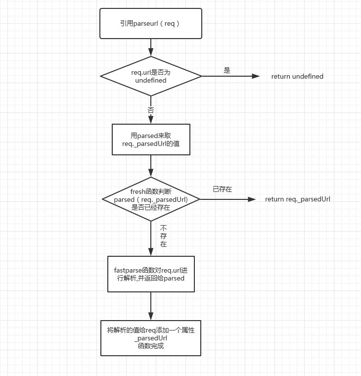

# parseurl 代码解读成果展示
## 一、代码仓库展示

#### 名称：parseurl

#### 功能：利用缓存的方法解析url

#### 地址：[https://github.com/GuoLiBin6/parseurl](https://github.com/GuoLiBin6/parseurl/)

#### 仓库包含文件及作用

> index.js

项目主文件，也是项目的入口文件，其中暴露的函数作为第三方模块引用

> README.md 

对项目作描述和说明

> .gitignore

用来排除不必要的项目文件或敏感信息文件，在此文件中写入的文件不会被提交到远程仓库

> LICENSE

文件统一用的MIT共享协议

> package.json

存储工程的元数据，描述项目的依赖项，类似配置文件。

项目依赖项：

benchmark：多元，多角度比较性的检测方式

beautify-benchmark：将结果输出为可读的表单

eslint：JS代码风格检测工具，可与jsHint比较查看，比之支持插件扩展，规则可配置性高

eslint-plugin-name: eslint插件

fast-url-parser：url解析器

Istanbul：代码覆盖率工具

mocha：自动化测试工具

> .travis.yml 

travis-ci持续集成工具的配置文件

> test文件夹

包含test.js文件，对index.js进行mocha自动化测试


> docs文件夹

存放项目文档

> images文件夹

存放index.js函数执行顺序的流程图

> benchmark文件夹

存放benchmark测试代码

## GitHub主页的test-parseurl仓库
parseurl-test.js文件和originalUrl-test.js对此模块的使用方法演示

## 二、代码解读
### 1.README.md文件解读
项目分类：第三方模块
### 2.index文件解读

#### 数据结构种类：

字符串：类型判断，值判断，截取赋值等

对象：作为函数返回值，作为对象的属性，类型判断等

#### 算法种类：

算法可大致分为基本算法、数据结构的算法、数论与代数算法、计算几何的算法、图论的算法、动态规划以及数值分析、加密算法、排序算法、检索算法、随机化算法、并行算法，厄米变形模型，随机森林算法。

if语句：判断，函数执行的分支

for循环语句：fastparse函数中检查字符串

switch语句：分类，对url进行解析

三目运算符：替代if else语句进行赋值

#### 设计模式种类：


代码分块


代码模块 | 是否为暴露模块|描述
---|---|---
var,require | |全局变量定义和引入第三方模块
exports | |暴露模块
parseurl(req)|是|对req.url判断，用缓存的方法解析url
originalurl(req)|是|对req.originalUrl判断，用缓存的方法解析
fastparse(str)|否|用url.parse(url)解析url
fresh(req,parsed)|否|判断此次解析的地址有没有进行过缓存

执行过程




### 3.parseurl-test.js文件和originalUrl-test.js文件


## 三、mocha自动化测试展示


## 四、travis-ci展示


## 五、benchmark展示


## 六、问题清单

1. 代码中是否有bug或可以改进的地方

  无
2. 代码可读性、结构和编码风格

可读性高，每个函数都有函数及参数说明，关键地方有英文注释

结构清晰明了，通过画流程图更加简单清晰

编码风格很好，合理利用空格和空行，阅读不会眼花缭乱，但是代码结束没有封号

3. 调试运行项目

将项目作为第三方库来安装引入进行调试，学习了express模块发起请求的方法

4. 拆分代码，单独研究

对fastparse函数进行Chrome调试，通过传入不同参数来查看函数执行过程，了解了url具体的解析过程
5. 数据结构种类：

字符串：类型判断，值判断，截取赋值等

对象：作为函数返回值，作为对象的属性，类型判断等

6. 算法种类：

算法可大致分为基本算法、数据结构的算法、数论与代数算法、计算几何的算法、图论的算法、动态规划以及数值分析、加密算法、排序算法、检索算法、随机化算法、并行算法，厄米变形模型，随机森林算法。

if语句：判断，函数执行的分支

for循环语句：fastparse函数中检查字符串

switch语句：分类，对url进行解析

三目运算符：替代if else语句进行赋值
7. 设计模式种类：

## 七、代码解读中的误区
1. 
```
var url=Url!==undefined
?new Url()
:{}
```
2.

```
function originalurl (req) {
  
  var url = req.originalUrl;
  
  if (typeof url !== 'string') {
    // Fallback
    return parseurl(req);
  }
  
 
  var parsed = req._parsedOriginalUrl;
  
  if (fresh(url, parsed)) {
    // Return cached URL parse
    return parsed;
  }

  // Parse the URL
  
  parsed = fastparse(url);
  
  parsed._raw = url;
  
  return (req._parsedOriginalUrl = parsed);
}
```
3. 


```
#!/usr/bin/node

var server = require('http').createServer();

var url=require('url');

var parseurl=require('parseurl');

server.on('request',function(req,res){

  console.log('req._parsedUrl',req._parsedUrl);//undefined

  console.log('');

  console.log('***************将要进行第一次解析*****************');

  parseurl(req);//对req进行解析

  console.log('****************第一次解析结束*********************');

  console.log('');

  console.log('req._parsedUrl',req._parsedUrl);//Url{...}


   });

server.listen(8080,function(){

  console.log('listening on port:',this.address().port);

});
```
问题描述：执行上述代码，执行解析后req._parsedUrl 有值，证明成功放入缓存，但是刷新浏览器，却拿不到缓存的值

原因：上述方法，第一次请求发送一个req，解析完成后存入缓存，但是没有对缓存内容操作，而是发出了第二次请求，又发送了一个req，所以第二次请求不能拿到第一次的缓存值

解决办法：

```
#!/usr/bin/node

var server = require('http').createServer();

var url=require('url');

var parseurl=require('parseurl');

server.on('request',function(req,res){

  console.log('req._parsedUrl',req._parsedUrl);//undefined

  console.log('');

  console.log('***************将要进行第一次解析*****************');

  parseurl(req);//对req进行解析

  console.log('****************第一次解析结束*********************');

  console.log('');

  console.log('req._parsedUrl',req._parsedUrl);//Url{...}
  parseurl(req);//对req进行第二次解析


   });

server.listen(8080,function(){

  console.log('listening on port:',this.address().port);

});
```
原因：发送一次请求，解析两次，第二次可以拿到第一次的值


